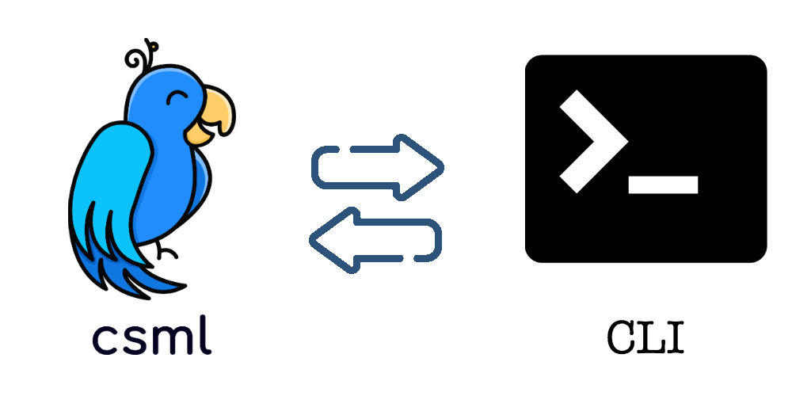
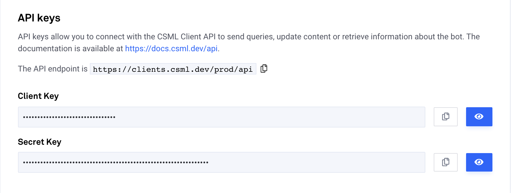
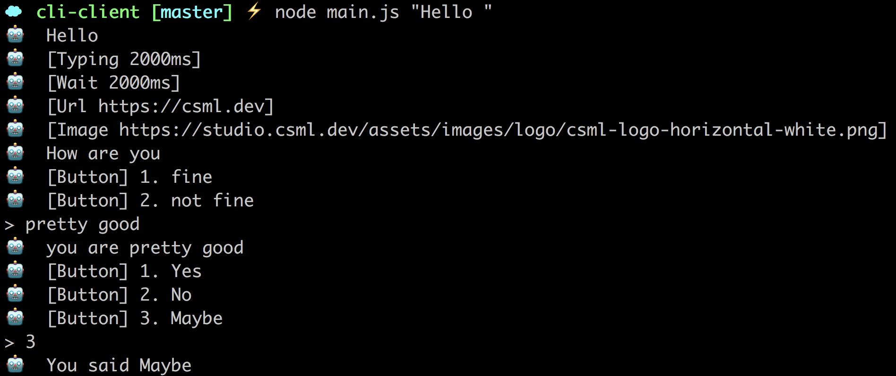

[](#)

# CLI Client for CSML

This CLI client is made to interact with chatbots created on https://studio.csml.dev and exposed through the API connector.

For more information about CSML, please refer to https://docs.csml.dev/#introduction.

## :cloud: Installation

### Install the client
```sh
$ npm i -g csml-client-cli
$ csml-client -h # display help section
```

### Create the CSML API connection
In the CSML studio, create a API connection.
[](#)

## :key: Authentication

To authenticate with the CSML studio, you will need CSML studio client and secret keys.

In your current directory, create a .env file containing the following lines:
```
CSML_API_CLIENT_KEY=xxx
CSML_API_SECRET_KEY=yyy
CSML_USER_ID=zzz
```
where CSML_API_CLIENT_KEY and CSML_API_SECRET_KEY are your actual keys, and CSML_USER_ID an optional unique string you pick to save the memory of your conversations under a specific user (by default if not set, a random string will be generated at each conversation restart).

Alternatively, you can also use command line options to authentify against the service:

```sh
csml-client --key xxx --secret yyy --user toto

# or shorthand notation:
csml-client -k xxx -s yyy -u toto
```

## :computer: Usage

```js
$ csml-client
> "Show me my AWS bill for last month"
```
This will start a conversation with your chatbot sending "Show me my AWS bill for last month" as the first message.

To stop a conversation, simply hit `ctrl+C`.

### Components
Here are a list of supported components:
- `Text()` is shown as expected
- `Url()` shows the url, your terminal might of might not provide an clicking interface
- `Image()` shows the url, your terminal might of might not provide an clicking interface
- `Wait()` shows the amount is async so the chatbot will not wait, although it will notice you of the instruction
- `Url()` shows the amount is async so the chatbot will not wait, although it will notice you of the instruction
- `Button()` shows a button as text with the option of selecting a button by tyuping its number (1, 2, 3, ...)
- `Question()` shows the question and the buttons shown as buttons components

[](#)


## :sunglasses: Enjoy
